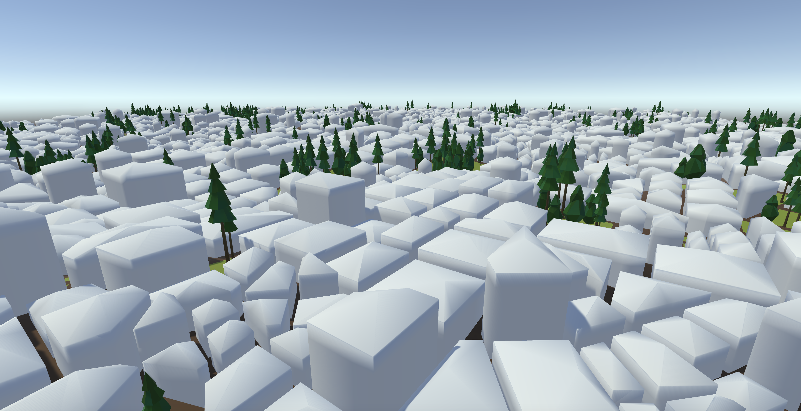
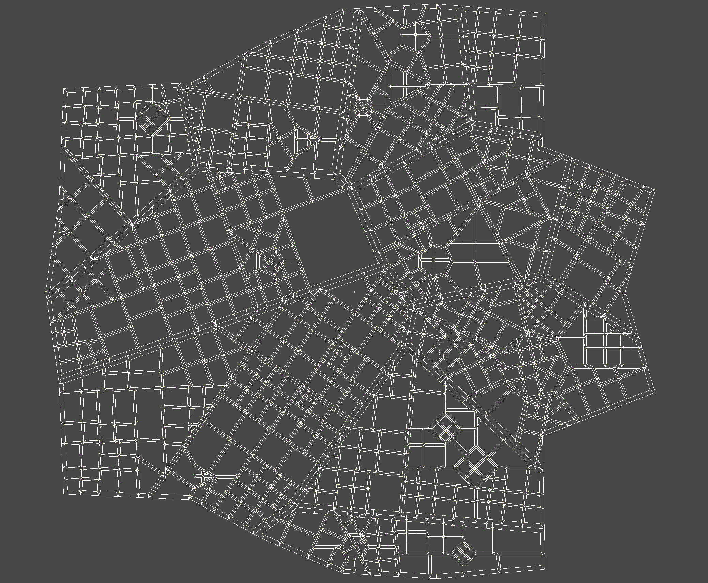
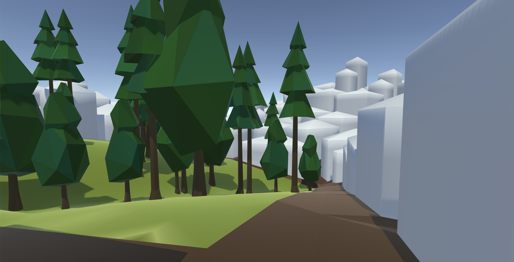

The city project is my most recent large-scale project. It began as some daydreaming about data structures and continued with months of research and development. In particular, I wondered how far the right datastrucure could be pushed to represent and generate a 3D city. 

THE DATA STRUCTURE / ALGORITHHM
--------

The city datastructure strongly resembles a that of meshes used in 3D graphics. Essentially, it is a set of city regions (polygons) formed by a set of edges. Regions share edges and edges know which regions they form. Regions can be anything like parks, town squares, blocks... a city itself even! City regions may be made of a set of smaller city regions. This concept differentiates the datastructure from a standard mesh datastructure. 

The city generation process is a recursive subdivision. Choices made of parks and block placements made early heavily influence the overall layout. For example, parks don't get subdivided further, city blocks do. Subdivision continues until a park is reached or a region is subdivided to the level of individual plots for houses. 

This recursive structure allows for highly specific layouts to be programmed. For example, high level regions can be assigned qualities such has socioeconomic status, business vs residential, etc. Properties like this can then be used as a driver for what types of road structures, parks, etc will be chosen in future subdivisions.   

Finally, the penultimate level of generation steals some land from each plot of land to give to the adjacent road. From here, the procedural house generation begins.

CONCLUSIONS
--------

The project served as a great learning experience with managing large scale datastructures. The versitility of the recursive generation approach could be used to creative ends if pushed further. In the future, I would love to explore creating more detailed 3D models to represent the underlying structures. That is the subject for a whole separate project, however.

