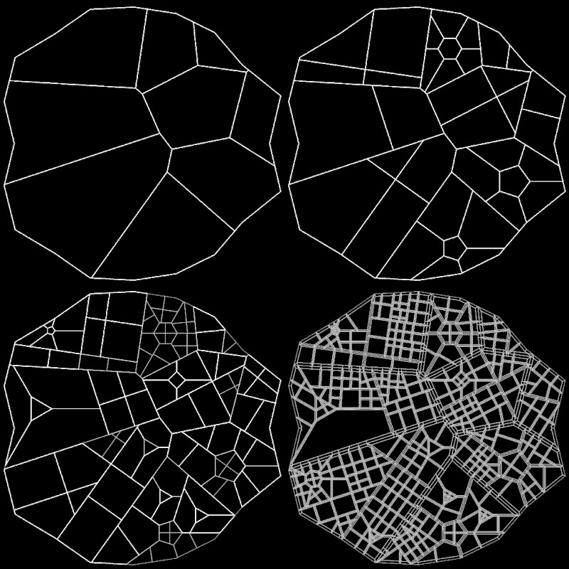

The city generator is my most recent large-scale project. The project is part of an ongoing mission of mine to create interesting content and worlds procedurally. In particular, this project had a data structures focus.

THE DATA STRUCTURE / ALGORITHM
--------

The city data structure strongly resembles that used to represent meshes in 3D modeling programs. Essentially, the structure is a set of city regions (polygons) formed by a set of edges. Regions share edges and edges know which regions they border. Regions can be classified as parks, town squares, blocks... a city itself even! Additionally, city regions may be made of a set of smaller city regions. This is one of the main concepts that differentiates the data structure from a standard mesh.

The city generation process is a recursive subdivision. Starting with the city border polygon, each city region is subdivided by a randomly chosen subdivision pattern. The regions formed following the subdivision are given a classification (parks, blocks, etc). 

Choices regarding parks and block layouts made early on heavily influence the overall layout. For example, parks don't get subdivided further, but city blocks do. Subdivision continues until a park is reached or a region is subdivided to the level of individual plots for houses. 

This recursive structure allows for detailed layouts to be programmed. For example, high level regions can be assigned qualities such has socioeconomic status, business vs residential, etc. These properties can be used to decide what types of road structures, parks, etc will be chosen in future subdivisions.   

Finally, the penultimate level of generation makes space for roads by taking some land from each plot. From here, the procedural house step would begin. 

CONCLUSIONS
--------

I believe the versatility of the recursive subdivision approach could be used to create very detailed immersive environments. In the future, I would love to explore creating procedural 3D models to represent buildings. That is the subject for a whole separate project, however.

