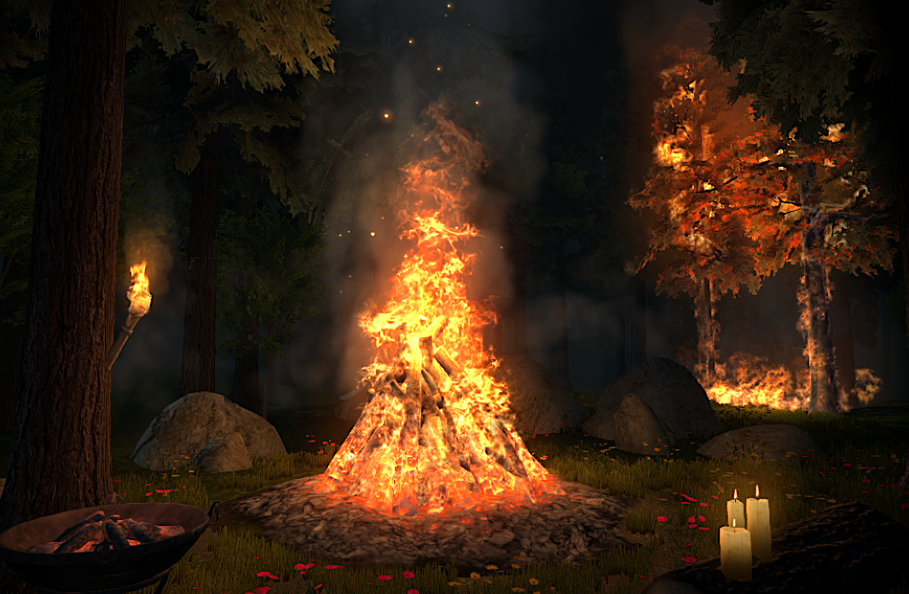
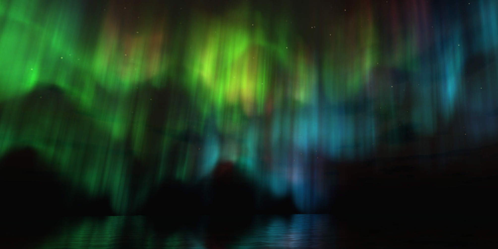

Since 2013, I have maintained a online business selling special effects through the Unity3D asset store. My work focuses on packs of effects in various catagories. Below I will outline the work currently available on the Asset Store.  

Fire Pack
-------
Being my earliest pack, the Fire Pack has gone through an evolution over its many years on the Asset Store. The current version utilizes meticulously sourced animations from real footage alongside carefully configured particle systems. Some alternative fire effects may use rendered or recorded fire footage with the absense of dynamic particles. This creates an effect that look good from one angle and suffers either repetitive looping or large file sizes. By using a combination of real footage and particles, the pack maintains visual complexity while not compromising on repetitiveness. 

Northern Lights
-------
The norther lights effects use particles and meshes with custom shaders to mimic the real volumetric phenomenon. Special care was taken to ensure the effects looked just as good in timelapse. Multiple color vaiations and shapes of the effect come with the package. 

Terrain Effects
-------

The Terrain Effects Solution is a framework for incorperating special effects into the natural envionment of your game. Unity3D lacks a method to add effects to the built-in terrain engine. With the Terrain Effects Solution, you can add effects like falling leaves to trees, blowing sand to regions of ground with a sand texture, etc. The framework manages the instantiating, object pooling and placement of these effects around the player as they navigate the world. 

<iframe width="100%" height="500px" src="https://www.youtube.com/embed/Vhe8OL3geXY" title="YouTube video player" frameborder="0" allow="accelerometer; autoplay; clipboard-write; encrypted-media; gyroscope; picture-in-picture" allowfullscreen></iframe>