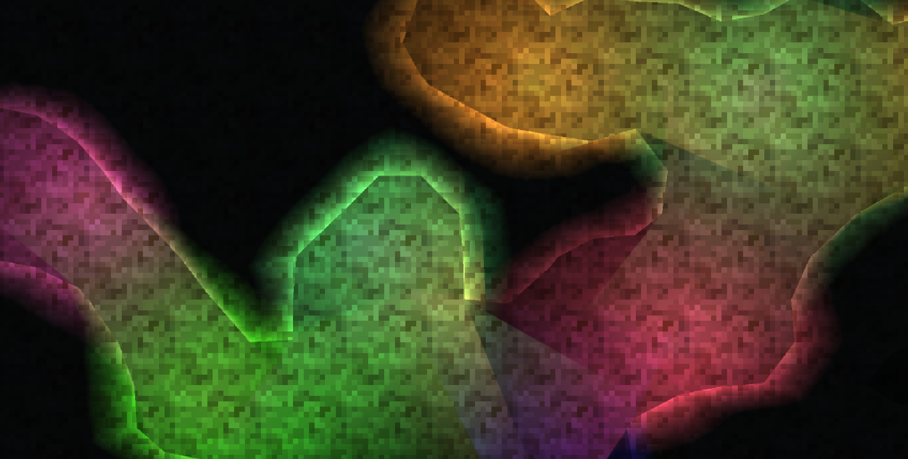

This project began as two separate side projects. One being a destructible 2D world using the Marching Squares algorithm. The other being an algorithm to generate 2D shadows for point light sources. 

<iframe src="https://player.vimeo.com/video/636559926?h=9ef1a03117&amp;badge=0&amp;autopause=0&amp;player_id=0&amp;app_id=58479" frameborder="0" allow="autoplay; fullscreen; picture-in-picture" allowfullscreen style="position:absolute;top:0;left:0;width:100%;height:100%;" title="lighting_demo"></iframe>

 

The World
----

The world is infinite and procedural. Tiles are generated around the player as they explore in any direction. The world data comes from a series of Perlin Noise layers which define different features such as terrain elevation as well as underground features such as cave rooms and cave passageways. 

World data is only saved after its been modified. Once the player destroys part of the world, the effected tiles are added to memory incase the modified tiles are revisited after having been unloaded. This allows the world to not consume significant memory during normal exploration. 

Lighting Engine
---

Light is rendered as procedural mesh geometry overlaid over each rendered frame. The lighting engine is responsible for updating light geometry whenever the terrain is altered by the player or loaded during exploration. 

