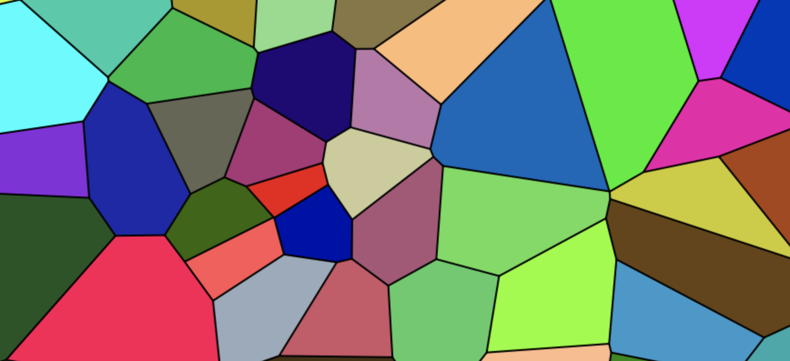
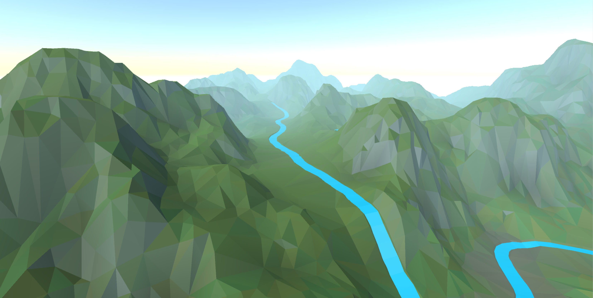

The low poly terrain project began as experimentation with [Delaunay triangulations](https://en.wikipedia.org/wiki/Delaunay_triangulation). After some research, I settled on an implementation and set to work on a practical application. Delaunay triangulations seemed like the perfect tool for creating a "low poly" aesthetic. Thus, the project began. 

<iframe src="https://player.vimeo.com/video/636569806?h=cb4c6bce5e&amp;badge=0&amp;autopause=0&amp;player_id=0&amp;app_id=58479" frameborder="0" allow="autoplay; fullscreen; picture-in-picture" allowfullscreen style="position:absolute;top:0;left:0;width:100%;height:100%;" title="LowPoly Demo"></iframe>

 

WORLD GENERATION
-----------

I have always had an interest in procedural content. Particularly, world generation. In the past, this interest has led to exploration of erosion algorithms, applications of various noise algorithms, and geological concepts for the use in world generation. In addition to exploring triangulation, this project expressed a culmination of some of this prior research. 

### LAND ZONES / BIOMES

Land zones are used to create diversity in the landscape. These include features like mountains, flatlands, ocean, etc. These land zones store presets for underlying 2D noise layers which influence the final elevation data. Land zone regions are distributed using a Voronoi diagram (pictured below). 

Biomes are used in a similar fashion. Different vegetation and color settings are applied based on a list of predefined biomes. 

### LAKES / RIVERS

Lakes and rivers are placed after the initial elevation data is generated. Both water systems are based on the concept of seeding. Potential rivers and lake seeds are planted throughout the landscape. These seeds are submitted to a validation process to ensure successful generation will occur. 

For lakes, this validation means ensuring that the lake has a shoreline that is contained within a maximum size limit. 

For rivers, a path to the ocean must be found. If a potential path is too complex or involves too much uphill travel, the seed is thrown out. The path is searched via an A* path finding algorithm. The heuristic of the search is the find a path requiring the least uphill travel. Once this path is identified, the terrain must be carved to ensure that the river never flows uphill. As a side benefit, this leads to the development river valleys!

TERRAIN ENGINE
------

The job of the terrain engine is to build and render a 3D mesh representing the generated terrain data. This includes generating meshes for lake water surfaces in addition to river water surfaces. 

A list of points is generated to represent the terrain surface. These points are random. However, they must be filtered in order to leave room for the more complex topology of river beds. A separate step adds additional points to fill out the shape of the river beds. After the filtering process, points are submitted to the triangulation algorithm and the final mesh is displaced according to the elevation data. 

The ability to have a continuous mesh represent smooth low detail regions as well as complex detailed regions is one of the main benefits of using Delaunay triangulations. This allows for significant creative potential such as adding highly detailed land formations that seamlessly fit with the normal terrain.  