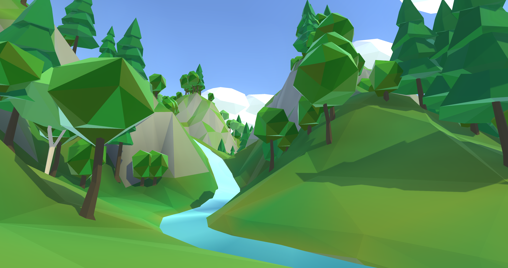

The low poly terrain project began as experimentation with delaunay triangulation. After some research, I settled on an implimentation and set to work on a practical application. Delaunay triangulations seemed like the perfect tool for creating a "lowpoly" aesthetic. Thus, the project began. 

WORLD GENERATION
-----------

I have always had an interest in procedural content. Particularly, world generation. In the past, this interest has led to exploration of erosion algorithms, applications of various noise algorithms, and geological concepts for the use in world generation. In addition to exploring triangulation, this project expressed a culmination of this prior research. 

### LAND ZONES / BIOMES

Land zones are used to create diversity in the landscape. These include features like mountains, flatlands, ocean, etc. These landzones store presets for underlying 2D noise layers used to create a heightmap. Landzone regions are defined using a voronoi diagram (pictured below). Biomes are used in a similar fashion. 

### LAKES / RIVERS

Lakes and rivers are placed after an initial heightmap is generated. Both water systems are based the concept of seeding. Potential rivers and lake seeds are planted throughout the landscape. These seeds run throughh a validation process to ensure successful generation will occur. 

For lakes, this validation means ensuring that the lake has a shoreline that is contained within a maximum size limit. 

For rivers, a path must be searched for to reach the ocean edge. If a potential path is too complex or involves too much uphill travel, the seed is thrown out. This path is searched for via an A* pathfinding algorithhm. The goal of the search is the find a path requiring the least uphill travel. Once this path is identified, the terrain must be carved to ensure that the river does not ever flow uphill. 

TERRAIN ENGINE
------

The job of the terrain engine is to build and render a 3D mesh representing the data generated in the prior world generation process. This includes generating meshes for lake water surfaces in addition to river water surfaces. 

First, a list of points is generated to seed the delaunay triangulation. These points are random, but must be filtered in order to leave room for the more complex topology of river beds. One of the main benefits of using delaunay triangulations for terrain surface meshes is that specific regions of the surface can be given more detail than others without compromising visual continuity. 