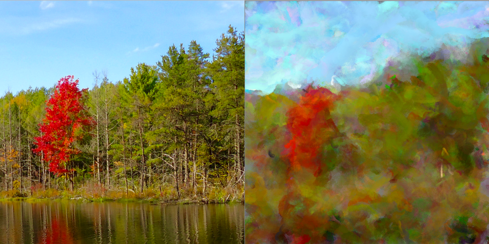
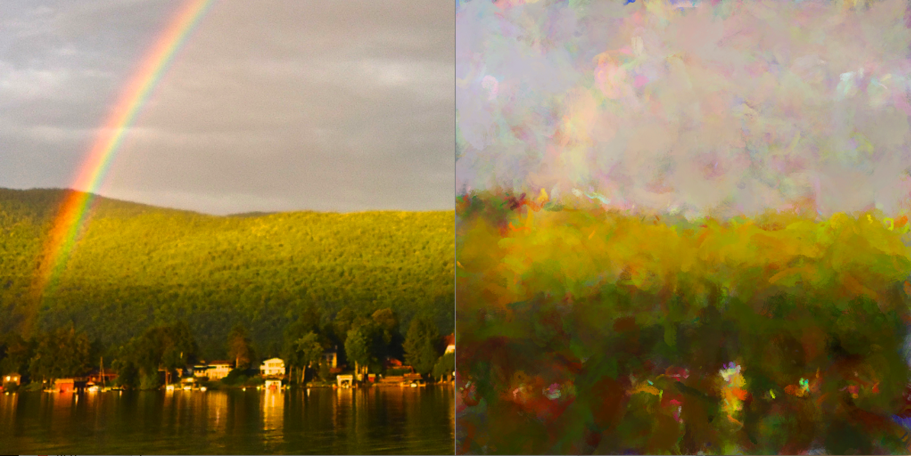

The painter project was an early experiment in the processing framework/language. The goal was an algorithm that could paint. The paintings should be more than just some filters but rather a series of brush strokes. 

How It Works
---

In order to paint, the program needed the ability to apply a paint stroke to a canvas. As such, the project has the framework of a basic painting program built in. This means different brushes, different brush sizes, and the ability to specify a brush stroke. 

Next is the issue of how the program would know what brush strokes to apply. The naive but successful answer is to just try random paint strokes and only keep the ones that 'improve' the overal painting. This improvement is measured in total pixel difference accross the entire canvas. 

