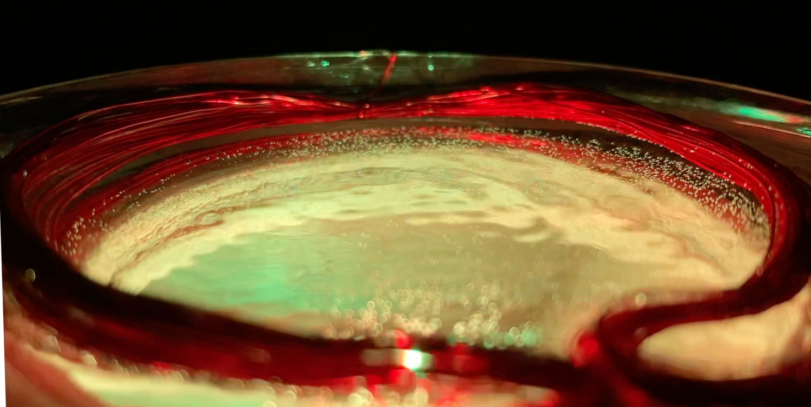
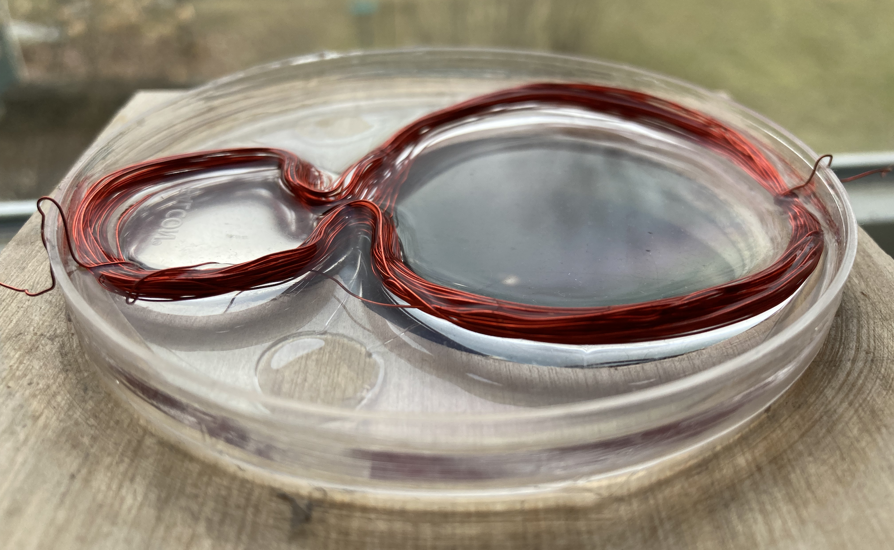

The music visualizer was one of my pandemic projects. The project solidified my interest in working with technology in the physical realm in addition to the digital. 

<!--  -->

<iframe src="https://player.vimeo.com/video/681061600?h=7920b50a5d&amp;badge=0&amp;autopause=0&amp;player_id=0&amp;app_id=58479" frameborder="0" allow="autoplay; fullscreen; picture-in-picture" allowfullscreen style="position:absolute;top:0;left:0;width:100%;height:100%;" title="Audio Visualizer Demo"></iframe>

<!-- The project began simply: I wanted to make an RGB music reactive light source of *some kind*. In the ideation phase, the project took many forms. The internal dialog was something like: 

Maybe I'll build a snow globe of sorts that would emit light and react to sound. The light will bounce off of the glitter snow making a cool pattern everywhere. Kind of like that thing I saw at my aunt's house over Christmas! 

 

What would keep the snow inside moving?

 

A motor would spin the globe, causing the snow inside to swirl around!

 

*Sounds like lots of moving parts. Not ideal.*

 

Maybe something could vibrate the globe, like a speaker but less... audible? How do speakers work?

 

These patterns that form in the water when it's vibrated are actually cooler than the original idea! Forget the globe, use a petri dish instead!

 

Something approximately like the above dialog ran in the background of my mind over the course of a few months. After significant experimentation I settled on the following:  -->

Originally, I wanted to make an RGB music reactive light source of *some kind*. After a few months of tinkering with the idea, I settled on the following prototype design:

**A copper coil sits in a clear dish of water. Like a speaker, an amplified audio signal is pumped through the coil. A magnet sits near the coil causing the coil to vibrate, thus inducing vibration in the water. Under the dish, install a high power LED that will shine through the water surface. Thus, the patterns in the water will be projected on the ceiling.**

Words cannot describe the sense of excitement and wonder I felt when the first working prototype began projecting the dancing patterns onto my bedroom ceiling. The temptation was to play as many of my favorite songs through the rig as I could think of. 

Each song has a different character through the visualizer. It all depends on how the song was arranged and mixed. Operating the lowest frequencies, the bass and kick drum seem to have the most profound effect on the visualization. I surmised that the high frequency tones (~600 hertz and above) were just too small to make a visual ripple in the water. 

Designing this project was a great experience and it only left me wanting to create more work that occupies the physical realm! 

